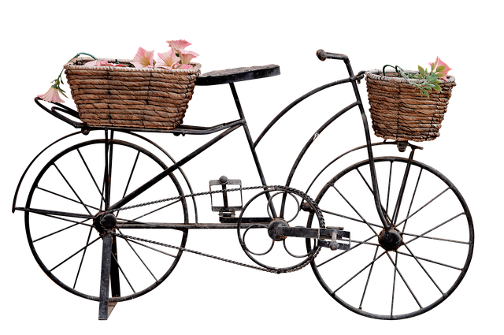

# stickerify
Add sticker-like border effect to images with transparency

Input:



```html

```

```js
const img = new Image(),
  out = document.getElementByID("out");

img.crossOrigin = 'anonymous';
img.onload = () => {
  out.src = stickerify(img, 3, 'red').toDataURL();
};
img.src = 'https://i.imgur.com/CgGLydT.png';
```

Output (:warning: this example is a bit extreme for demo effects, it looks much better on most images):


